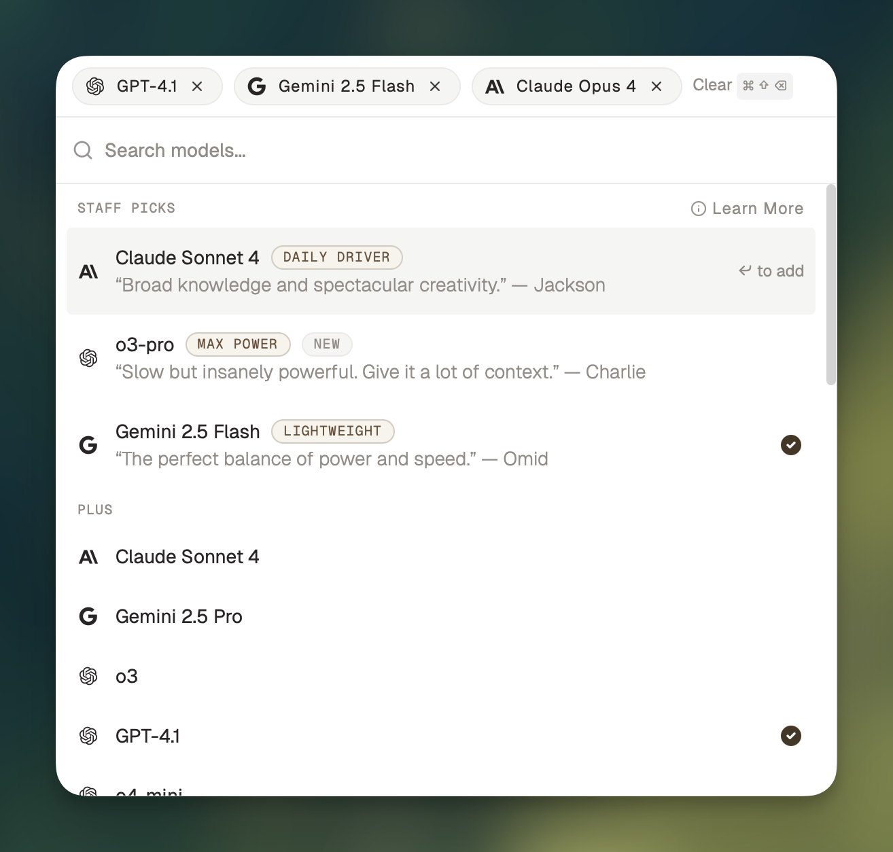

## Picking a Model

Picking a model is, in some ways, deeply personal. The best thing to do is try out different models and see how they perform for you.

That’s one of the reasons why we built [Chorus](http://chorus.sh/), a Mac app that lets you chat with the best models all at once on your Mac. Today, Chorus natively offers 17 models to choose from across 6 different providers—plus local models through Ollama and LMStudio, and hundreds more through OpenRouter.

That said, the pace of change in the LLM space can feel overwhelming. That’s why **we’ve rounded up the top 3 models we’re using most**.

## What We’re Using

### Daily Driver 🚗  Claude Sonnet 4

> What sets Claude apart is its personality, which really shines through in its writing. It’s got broad knowledge and spectacular creativity. Swap in Opus (which is slower than Sonnet, but with a bit more firepower) for obscure topics and thorny problems.
> 
> 
> Runner up: [Gemini 2.5 Pro](https://x.com/charliebholtz/status/1909810772651524471)
> 
> —Jackson
> 

### Max Power 🚂  OpenAI o3-pro

> Slow but insanely powerful. I recommend giving o3-pro a ton of context and concrete asks and letting it cook. I like the analogy in [Ben Hylak’s review](https://www.latent.space/p/o3-pro): think of o3-pro as a report generator rather than a conversationalist.
> 

—Charlie

### Lightweight  🚲  Gemini 2.5 Flash

> When I need an answer quick, I typically reach for Gemini 2.5 Flash. It offers accurate, relevant info consistently while providing response speeds that often exceed our Daily Driver and Max Power picks (while of course, making some sacrifices for more difficult tasks).
> 
> 
> I use Gemini 2.5 Flash when I need a quick answer for the following use cases: 
> 
> - High-level queries
> - Text based problems
> - Vision problems (the Gemini family in general is quite good in this area)
> 
> Runner up: GPT 4.1 
> 
> —Omid
> 

## Our Methodology

If you needed to hire an assistant, it might be helpful to know their SAT scores — but it’d be a lot more helpful to get a recommendation from someone they’ve worked with in the past. And though many people rely on benchmarks and test scores to evaluate LLMs, we find it more useful to rely on good old-fashioned real-world experience. 

We’re constantly using LLMs in our own daily workflows, using trial and error to figure out which LLMs work best for our use cases. Here are a couple of factors we keep in mind when making our staff picks: 

- **Correctness:** Is the answer factually accurate? Does the model follow instructions?
- **Hallucination:** Does the model make things up?
- **Tool use:** Does it do a good job using tools to find information and take action?
- **Latency:** How fast does the model start its response? How fast does it finish writing?